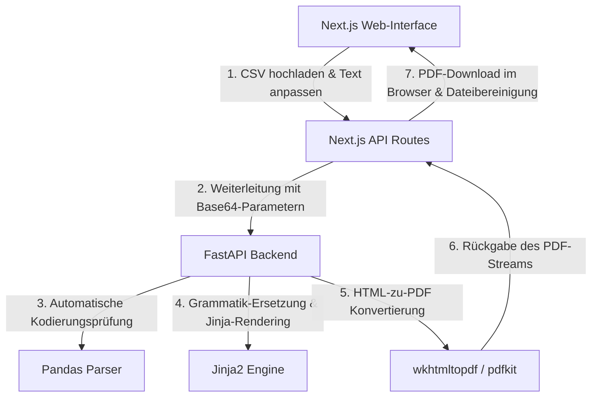

# AWO Brief- & Urkunden-Generator

Ein moderner, modularer Web-Generator zur Erstellung von DIN-5008-konformen Geburtstagsbriefen und Ehrenurkunden aus CSV-Mitgliederlisten. Speziell entwickelt für die **AWO Oberlar e. V.**

---

## 🌟 Features

- **DIN 5008 Konformität**: Exakte Platzierung des Anschriftfeldes für DL-Fensterumschläge, inklusive Falz- und Lochmarken auf A4-Format.
- **100% Code-Freie Vorlagen (No-Code Templates)**: Neue Vorlagen (wie Urkunden, Bestätigungen oder Briefe) können rein deklarativ über die `templates.json` registriert werden.
- **Live-Textanpassung**: Betreffzeile und Textabsätze können direkt im Web-Interface vor der PDF-Erstellung live editiert werden.
- **Benutzerfreundliche Platzhalter**: Automatische Grammatikanpassung (z. B. `[Dir/Ihnen]`, `[Dein/Ihr]`, `[erhältst/erhalten]`) passend zur Briefanrede (Du-Form vs. Sie-Form).
- **Dynamisches Interface-Branding (Theme Sync)**: Die Benutzeroberfläche passt ihre Farben (z. B. Rot für Geburtstage, Gold für Urkunden) dynamisch an das ausgewählte Template an.
- **Datenschutz & DSGVO-Konformität**: Automatisches Löschen hochgeladener CSV-Listen und temporärer PDFs direkt nach der Generierung.
- **Lokale wkhtmltopdf-Erkennung**: Automatischer Suchpfad für standardmäßige Windows-Installationspfade von `wkhtmltopdf.exe`.

---

## 🛠️ Technologie-Stack

- **Frontend**: Next.js (React), Tailwind CSS-freie native CSS-Custom-Properties für dynamisches Theme-Branding.
- **Backend**: FastAPI (Python), Pandas (CSV-Parsing & Encoding-Erkennung), Jinja2 (HTML-Templating), PDFKit / wkhtmltopdf.
- **Containerisierung**: Docker & Docker Compose.

---

## 🏗️ Systemarchitektur



---

## 🚀 Installation & Lokaler Start

### Voraussetzungen
- **Node.js** (v18+)
- **Python** (v3.10+)
- **wkhtmltopdf** (für PDF-Konvertierung)
  - [Download wkhtmltopdf](https://wkhtmltopdf.org/downloads.html) und installieren. Unter Windows wird der Pfad automatisch gesucht.

---

### 💻 Automatische Einrichtung & Start (Empfohlen)

Sie können das gesamte Projekt (Frontend und Backend) mit einem einzigen Befehl starten. Das Skript `run.py` prüft und erstellt automatisch die virtuelle Python-Umgebung, installiert alle Backend- und Frontend-Abhängigkeiten und startet beide Server parallel:

```bash
python run.py
```

Das Frontend ist dann unter `http://localhost:3000` erreichbar, das Backend unter `http://localhost:8000`. Beenden Sie beide Dienste mit `Ctrl + C`.

---

### 🛠️ Manueller Start (Alternativ)

### 1. Backend starten (FastAPI)

1. Navigieren Sie in den Ordner `fast_api`:
   ```bash
   cd fast_api
   ```
2. Erstellen Sie eine virtuelle Umgebung und aktivieren Sie diese:
   ```bash
   python -m venv .venv
   # Windows:
   .venv\Scripts\activate
   # Linux/macOS:
   source .venv/bin/activate
   ```
3. Installieren Sie die Abhängigkeiten:
   ```bash
   pip install -r requirements.txt
   ```
4. Starten Sie den FastAPI-Server:
   ```bash
   python main.py
   ```
   Der Server läuft unter `http://localhost:8000`.

---

### 2. Frontend starten (Next.js)

1. Öffnen Sie ein neues Terminal im Hauptverzeichnis des Projekts.
2. Installieren Sie die NPM-Abhängigkeiten:
   ```bash
   npm install
   ```
3. Starten Sie den Next.js-Entwicklungsserver:
   ```bash
   npm run dev
   ```
   Die App ist nun im Browser unter `http://localhost:3000` erreichbar.

---

## 🐳 Starten mit Docker (Alternativ)

Wenn Sie Docker installiert haben, können Sie das gesamte System mit einem einzigen Befehl starten:

```bash
docker-compose up --build
```
Docker Compose startet das Next.js Frontend auf Port `3000` und das FastAPI-Backend auf Port `8000`.

---

## 📁 CSV-Struktur & Pflichtspalten

Je nach gewähltem Template werden unterschiedliche Spalten in der hochgeladenen CSV-Datei benötigt:

### 1. Standard-Geburtstagsbrief (`birthday_standard`)
Die Tabelle muss folgende Spaltennamen enthalten:
- `Vorname`
- `Nachname`
- `Briefanrede` (z. B. *Lieber Daniel*, *Sehr geehrte Frau Müller*)
- `Geburtsdatum` (Format: `TT.MM.JJJJ`)
- `Straße`
- `Postleitzahl`
- `Ort`

### 2. Urkunde (`urkunde_standard`)
Erfordert lediglich:
- `Vorname`
- `Nachname`
- `Briefanrede` (Optional, für die dynamische Anrede `[Dir/Ihnen]`)

---

## 📄 Lizenz
Dieses Projekt ist lizenziert unter der MIT-Lizenz.